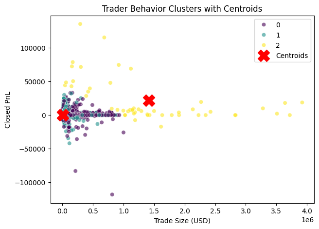
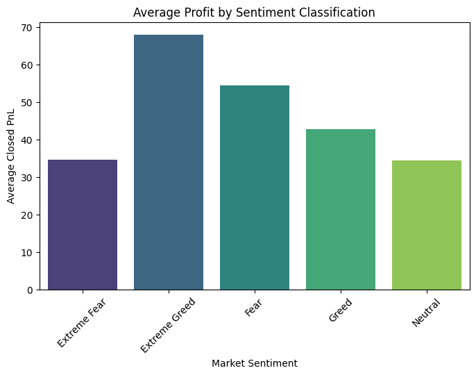

# Trader Behavior Analysis Using Market Sentiment

## Objective

The objective of this project is to analyze the relationship between **trader performance and market sentiment** using historical trading data and the Crypto Fear & Greed Index.

The analysis aims to uncover behavioral patterns in trading activity and generate insights that could help design **smarter trading strategies**.

---

# Dataset Description

## 1. Historical Trader Data

The trading dataset contains detailed information about executed trades, including:

* Account (trader identifier)
* Coin traded
* Execution price
* Trade size (USD)
* Trade direction (Long/Short)
* Closed profit or loss (Closed PnL)
* Trading fee
* Timestamp

This dataset captures how traders behave under different market conditions.

---

## 2. Market Sentiment Data

The sentiment dataset is based on the Crypto Fear & Greed Index, which measures overall market emotion.

It includes:

* Sentiment classification (Extreme Fear, Fear, Neutral, Greed, Extreme Greed)
* Sentiment score
* Date

The two datasets were merged using the **date field**.

---

# Data Preprocessing

Several preprocessing steps were applied before analysis:

* Standardized column names
* Converted timestamps to datetime format
* Extracted trade date from timestamp
* Merged trading and sentiment datasets
* Checked for missing values
* Removed duplicate records
* Detected outliers using the IQR method

Outliers were retained because extreme profit and loss values are common in leveraged cryptocurrency trading.

---

# Exploratory Data Analysis

The following aspects of trading behavior were analyzed:

* Distribution of market sentiment states
* Trading activity across sentiment categories
* Average profit across different sentiment states
* Trade size variations during Fear vs Greed periods
* Performance comparison of Long vs Short trades
* Relationship between sentiment index values and profit outcomes
* Identification of top profitable traders
* Correlation between trading variables

These analyses helped identify behavioral patterns among traders.

---

# Unsupervised Learning for Pattern Discovery

To uncover hidden patterns in trading behavior, clustering was performed using K-Means Clustering.

The clustering model grouped trades based on:

* Trade size (USD)
* Closed PnL (profit/loss)
* Market sentiment score

Cluster visualization revealed distinct trading behavior groups such as:

* **Conservative traders** executing small trades with limited profit/loss
* **Moderate traders** with medium trade sizes and higher volatility
* **Aggressive traders** executing very large trades with extreme profit and loss outcomes

This clustering approach helps understand different trader risk profiles.


---

# Key Insights

### 1. Trading Activity Increases During Greed

The number of trades increases significantly during Greed sentiment periods, suggesting that traders are more active when market optimism is high.

### 2. Profitability Improves During Greed Periods

Average trading profits tend to be higher during Greed sentiment, indicating that bullish market conditions provide more profitable opportunities.


### 3. Larger Trades Occur During Greed

Average trade size increases during Greed periods, suggesting that traders take larger risks when market sentiment is positive.

### 4. Long Trades Perform Better

Long trades generally outperform short trades in terms of average profitability, reflecting the tendency of crypto markets to experience bullish trends.

### 5. Trade Size Strongly Influences Fees

Correlation analysis shows that trading fees are strongly correlated with trade size, indicating that transaction costs increase proportionally with trade volume.

### 6. Distinct Trader Behavior Groups Exist

Clustering analysis reveals multiple trading behavior profiles, including conservative and aggressive traders with varying levels of risk exposure.

---

# Strategy Recommendations

### 1. Utilize Momentum Strategies During Greed

Since profitability and trading activity increase during Greed periods, traders may benefit from momentum-based strategies in bullish markets.

### 2. Reduce Exposure During Fear Markets

Lower profitability during Fear sentiment suggests that traders should reduce position sizes and apply stricter risk controls.

### 3. Apply Strong Risk Management

Large profit and loss variations highlight the importance of stop-loss strategies and disciplined position sizing in volatile crypto markets.

---
### Fear and Greed Index Value


# Technologies Used

* Python
* Pandas
* NumPy
* Matplotlib
* Seaborn
* Scikit-learn

---

# Project Structure

```
trader-behavior-analysis/
│
├── new.ipynb
├── README.md
└── datasets/
```

---

# Conclusion

This project demonstrates how combining **market sentiment analysis with trading data** can reveal behavioral patterns among traders. These insights can support the development of **data-driven trading strategies and better risk management practices**.

---
